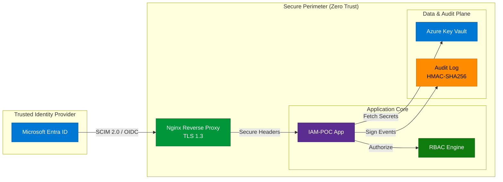

# IAM Security Blueprint — Azure-Native Zero Trust Architecture
### Cloud Security · SCIM 2.0 · Terraform IaC · Cryptographic Non-Repudiation

[](https://github.com/Alexs1004/iam-poc/actions/workflows/ci.yml)


> **Architectural Portfolio for Cloud Security Engineering roles.**
> This project is not just an application; it is a reference architecture demonstrates how to enforce **Identity as the Perimeter** in a regulated environment (Swiss FINMA/nLPD). It bridges the gap between Identity Providers (Entra ID) and secure internal applications using modern standards.

---

## 🎯 Executive Summary (The "Why")

Identity events (Joiner, Mover, Leaver) are the most critical attack vector in modern enterprises. This solution provides a **secure, auditable, and automated** foundation for identity management.

*   **Zero Trust**: No implicit trust. Authentication (OIDC) and Provisioning (SCIM) are strictly decoupled and validated.
*   **Non-Repudiation**: Every administrative action creates a cryptographically signed (HMAC-SHA256) audit trail, preventing log tampering.
*   **Defense in Depth**: Security controls are applied at the Network (Nginx/TLS), Identity (MFA), and Application (RBAC) layers.

---

## 🏗️ Security Architecture

The system acts as a secure bridge between the Corporate IdP and sensitive downstream resources.



---

## 🚀 Operations & Usage

Select your user journey to verify the platform capabilities.

### 👔 The Recruiter Path (2-min demo)
See the project in action immediately using the automated demo script.

```bash
# 1. Start the stack & Provision demo users (Zero Config)
make quickstart

# 2. Access the secure dashboard
# ⮕ https://localhost (Accept self-signed cert)
# Login: joe / Temp123!
```

### 🕵️ The Security Auditor Path
Verify the cryptographic controls and secure implementation.

```bash
# Verify Non-Repudiation (HMAC-SHA256 Check)
make verify-audit
# > Output: ✓ All 22 events have valid HMAC-SHA256 signatures

# Run SAST & Secret Detection (Gitleaks/Trivy)
make security-check

# Generate Software Bill of Materials (Supply Chain Security)
make sbom
```

### 👷 The DevOps Path
Maintain and diagnose the infrastructure reliability.

```bash
# Run Health Checks (Containers, Secrets, HTTPS)
make doctor
# > Output: 🩺 IAM-POC Doctor - environment health check

# Preview Infrastructure Changes (Terraform)
make infra/plan
```

---

## ☁️ Infrastructure as Code (Azure Terraform)

Infrastructure is treated as ephemeral software, deployed via Terraform with strict state security.

*   **Codebase**: [`/infra`](infra/README.md)
*   **State Management**: Azure Storage Backend with Server-Side Encryption (AES-256) and Versioning (Rollback capability).
*   **Networking**: Prepared for Private Link integration (Switzerland North region).
*   **Compliance**: Resources tagged for data sovereignty and lifecycle checking.

> **Key Takeaway**: The infrastructure supports **immutable deployments** where no manual interaction with the cloud console is required.

---

## 🔐 Core Security Concepts Demonstrated

### 1. Advanced RBAC & Least Privilege
We implement a granular permission model beyond simple "Admin vs User":
*   **`Analyst`**: Read-only visibility on identities.
*   **`IAM Operator`**: Functional access (JML workflows) but cannot escalate privileges.
*   **`Realm Admin`**: Break-glass/Root access, strictly monitored.
*   **`Automation`**: Service accounts constrained by SCIM scopes (`scim:write`).

### 2. The JML Lifecycle (Automated)
*   **Joiner**: Automated provisioning via SCIM 2.0 (RFC 7644).
*   **Mover**: Role transition with immediate session revocation (token invalidation).
*   **Leaver**: GDPR-compliant soft-delete capability.

### 3. Cryptographic Audit Trail
To satisfy **FINMA** (Swiss Financial Market Supervisory Authority) requirements, standard text logs are insufficient.
*   **Mechanism**: Each log entry is hashed using an HMAC secret stored in Key Vault.
*   **Validation**: `make verify-audit` recomputes the chain to detect any tampering or deletion.

---

## 📚 Deep Dive Documentation (Index)

I have organized the documentation to facilitate deep-dives into specific domains:

| Domain | Document | Target Audience |
|--------|----------|-----------------|
| **Recruitment** | 👉 **[Hiring Pack / Skills Matrix](docs/Hiring_Pack.md)** | **Recruiters & Hiring Managers** |
| **Risk** | [Threat Model (STRIDE/MITRE)](docs/THREAT_MODEL.md) | Security Architects |
| **Architecture** | [Security Design (OWASP/NIST)](docs/SECURITY_DESIGN.md) | Lead Engineers |
| **Operations** | [JML Demo Scenarios](docs/RBAC_DEMO_SCENARIOS.md) | SOC / IAM Ops |
| **DevOps** | [Infrastructure (Terraform)](infra/README.md) | Cloud Engineers |
| **Azure AD** | [Entra ID Integration](docs/ENTRA_SCIM_HOWTO.md) | IAM Engineers |
| **Production** | [Deployment Guide](docs/DEPLOYMENT_GUIDE.md) | SRE / DevOps |
| **Integration** | [API Reference](docs/API_REFERENCE.md) | Developers |

