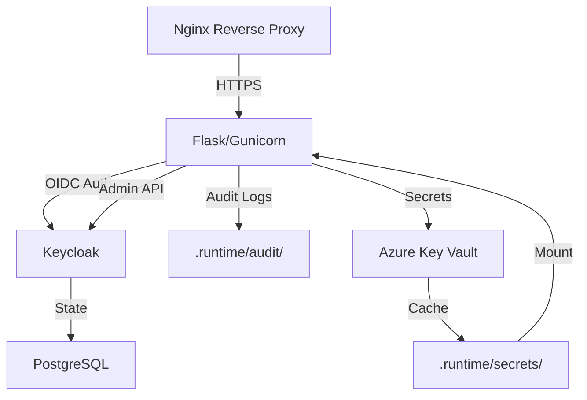

# Architecture Improvements Roadmap

This document lists potential architectural improvements for future iterations.

## Current State (✅ Completed)

- ✅ Clean Architecture: `core/` isolated from HTTP layer
- ✅ Keycloak client modularized (`app/core/keycloak/`)
- ✅ Tests stratified (unit, integration, E2E)
- ✅ Dead code removed (`scripts/*.backup`, `scripts/*.old`, empty files)
- ✅ `.gitignore` improved (backup files, Python cache)

## Recommended Next Steps

### 1. Move `app/scim_api.py` to `app/api/scim.py`

**Current location**: `app/scim_api.py` (477 lines)
**Target location**: `app/api/scim.py`

**Rationale**: All HTTP route handlers should be in `app/api/` for consistency.

**Files to update** (2 files):
```python
# app/flask_app.py (line 79)
- from app import scim_api
+ from app.api import scim

# tests/test_scim_api.py (line 15)
- from app.scim_api import scim
+ from app.api.scim import scim
```

**Commands**:
```bash
git mv app/scim_api.py app/api/scim.py
# Update imports in flask_app.py and test_scim_api.py
pytest  # Verify all tests still pass
```

**Impact**: None (pure refactoring, no behavior change)

---

### 2. Consider Removing `app/admin_ui_helpers.py`

**Current state**: Used by `app/api/admin.py` for DOGFOOD_SCIM mode.

**Question**: Is DOGFOOD_SCIM mode still needed?
- **If YES**: Keep as-is (allows admin UI to dogfood its own SCIM API)
- **If NO**: Inline the functions directly in `app/api/admin.py`

**Decision criteria**: Check if `DOGFOOD_SCIM=true` is documented/used anywhere.

---

### 3. Add Architecture Diagram

**Recommended tool**: Mermaid (renders in GitHub)

**Example** (`docs/ARCHITECTURE.md`):


---

### 4. Consider Splitting Admin UI from SCIM API

**Current**: Single Flask app with 2 blueprints (`/admin/*`, `/scim/v2/*`)

**Future** (for scale): 2 separate services
```
Nginx Ingress
├─> Admin UI Service (Flask) → Port 8001
└─> SCIM API Service (FastAPI) → Port 8002
         ↓
    Shared core/ package (PyPI private)
         ↓
    Keycloak
```

**Benefits**:
- Independent scaling (SCIM API 10 replicas, UI 2 replicas)
- Independent deployment (hotfix SCIM without restarting UI)
- Technology flexibility (FastAPI for SCIM = better OpenAPI docs)

**Timeline**: 6-12 months (requires significant refactoring)

---

## How to Use This Document

1. **Review before major refactoring**: Check if planned changes align with roadmap
2. **Update when completed**: Move items from "Next Steps" to "Current State"
3. **Discuss architecture decisions**: Reference this doc in PRs/issues

---

**Last Updated**: 2025-10-24
**Maintainer**: @Alexs1004
