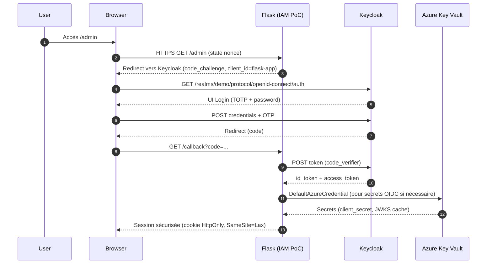
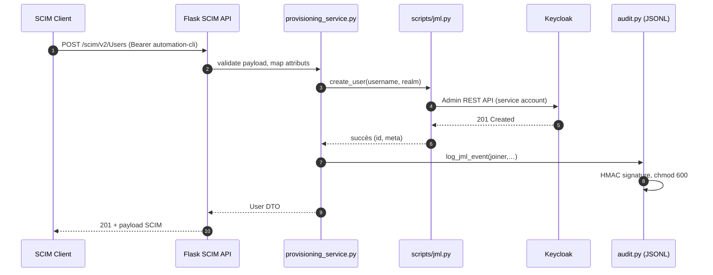

# SCIM & OIDC Flow (Swiss Azure PoC)

Ce document illustre le parcours d’authentification OIDC, le provisioning SCIM ainsi que le mapping d’attributs dans le cadre du PoC IAM orienté recrutement.

## 1. Séquence OIDC (PKCE)

## 2. Séquence SCIM (Service Account)

## 3. Mapping d’Attributs

| SCIM                        | Keycloak                               | Commentaire                                        |
|----------------------------|-----------------------------------------|----------------------------------------------------|
| `userName`                 | Username                                | Normalisé lowercase, sans accents.                 |
| `name.givenName`           | `firstName`                             | UTF-8 autorisé, max 64 caractères.                 |
| `name.familyName`          | `lastName`                              | Idem, obligatoire pour création.                   |
| `emails[primary].value`    | `email`                                 | Validation stricte (regex + domaine).              |
| `active`                   | User enabled/disabled                   | `false` ⇒ disable + revoke sessions.               |
| `externalId`               | Keycloak attribute `externalId` (custom)| Optionnel, utilisé pour mapping ATS.               |
| `meta.location`            | Calculé par Flask                       | Ex: `https://host/scim/v2/Users/{id}`              |
| `schemas`                  | RFC 7644 core                           | Aucun schéma custom pour PoC.                      |

## 4. Points d’attention

- **OAuth obligatoire** : chaque appel SCIM doit fournir un bearer token (service account `automation-cli`).  
- **Filtrage restreint** : seul `filter=userName eq "value"` est autorisé pour limiter les risques d’injection SCIM.  
- **Audit trail** : toute opération génère une entrée signée HMAC (non répudiation).  
- **Migration Entra ID** : mapping identique (userPrincipalName ⇄ `userName`) ; prévoir extension attributs custom.  
- **Limites** : opérations PATCH limitées à `replace` (nom, email, active).

Références : RFC 7644, RFC 7643, FINMA Circ. 08/21 (sécurité des API), nLPD art. 8-12 (principes).

